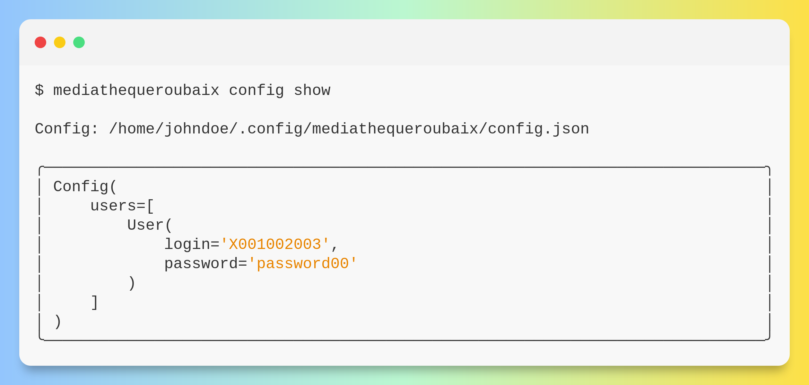
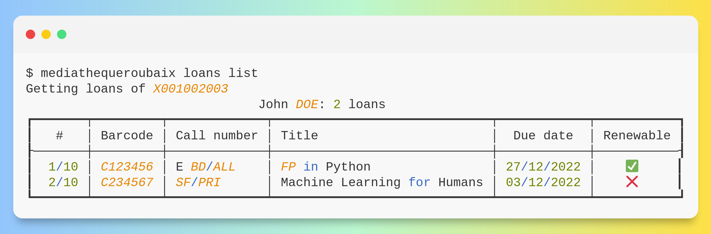

<p align="center" width="100%">
  
</p>

# Python CLI for the library of Roubaix (Médiathèque Roubaix)

[](https://pypi.python.org/pypi/mediathequeroubaix/)
[](https://pypi.python.org/pypi/mediathequeroubaix/)
[](https://pypi.python.org/pypi/mediathequeroubaix/)

---

**Releases**: [https://github.com/tomsquest/mediathequeroubaix.py/releases](https://github.com/tomsquest/mediathequeroubaix.py/releases)

**Source Code**: [https://github.com/tomsquest/mediathequeroubaix.py](https://github.com/tomsquest/mediathequeroubaix.py)

**PyPI**: [https://pypi.org/project/mediathequeroubaix/](https://pypi.org/project/mediathequeroubaix/)

---

<!-- START doctoc generated TOC please keep comment here to allow auto update -->
<!-- DON'T EDIT THIS SECTION, INSTEAD RE-RUN doctoc TO UPDATE -->
## Table of Contents

- [Features](#features)
  - [Display your loans](#display-your-loans)
  - [Renew your loans](#renew-your-loans)
- [Usage](#usage)
  - [Running](#running)
  - [Create an initial, sample configuration](#create-an-initial-sample-configuration)
  - [Display the current configuration](#display-the-current-configuration)
  - [List the loans](#list-the-loans)
  - [Renew the loans](#renew-the-loans)
- [Why I am doing this](#why-i-am-doing-this)
- [Changelog](#changelog)
- [Development](#development)
  - [Releasing](#releasing)
- [Credits](#credits)

<!-- END doctoc generated TOC please keep comment here to allow auto update -->

## Features

MédiathèqueRoubaix.py is a client for the **libray of Roubaix**, [mediathequederoubaix.fr](http://www.mediathequederoubaix.fr/).

<p align="center" width="100%">
  
</p>

### Display your loans

Running `mediathequeroubaix loans list` will:

1. Get the **list of your loans** and their due date
2. ...for **many cardholders**
3. and check the **next return date** for each of your card

### Renew your loans

Running `mediathequeroubaix loans renew` will:

1. Renew **automatically** all loans
2. ...for **many cardholders**
3. and print the **new due date** of the loans

## Usage

### Running

With Pipx:

```shell
pipx run mediathequederoubaix
```

With UV:

```shell
uvx mediathequederoubaix
```

If you want to install it globally:

```shell
pipx install mediathequeroubaix
```

### Create an initial, sample configuration

`config create` makes a sample configuration in `$HOME/.config/mediathequederoubaix/config.json` and display the content of the file.  
The configuration is initialized with a sample but fake user.

```shell
mediathequeroubaix config create
```

<p align="center" width="100%">
  
</p>

### Display the current configuration

`config show` displays the current configuration.

```shell
mediathequeroubaix config show
```

<p align="center" width="100%">
  
</p>

### List the loans

`loans list` show the list of loans for the users.

```shell
mediathequeroubaix loans list
```

<p align="center" width="100%">
  
</p>

### Renew the loans

`loans renew` renew the list of loans for the users and display the new loans.

```shell
mediathequeroubaix loans renew
```

<p align="center" width="100%">
  
</p>

## Why I am doing this

I created this project to:

1. Learn **Functional Programing**
2. Learn **typed** and **modern** Python
3. Be able to quickly list and renew my loans (especially when you have many cards)

## Changelog

See [CHANGELOG.md](CHANGELOG.md)

## Development

* Clone this repository
* Install [UV](https://docs.astral.sh/uv/)
* (Optional) if using direnv, create .envrc with:
```
uv sync
source .venv/bin/activate
```

* Testing

```sh
pytest
```

* Check everything in one go

```sh
pre-commit run --all-files
```

### Releasing

Trigger the [Draft release workflow](https://github.com/tomsquest/mediathequeroubaix.py/actions/workflows/draft_release.yml)
(press _Run workflow_). This will update the changelog & version and create a GitHub release which is in _Draft_ state.

Find the draft release from the
[GitHub releases](https://github.com/tomsquest/mediathequeroubaix.py/releases) and publish it. When
a release is published, it'll trigger [release](https://github.com/tomsquest/mediathequeroubaix.py/blob/master/.github/workflows/release.yml) workflow which creates PyPI
release.

## Credits

- Background and color from [PrettySnap](https://prettysnap.app/)
- Python project bootstrapped using [Wolt template](https://github.com/woltapp/wolt-python-package-cookiecutter)
- Functional library is [Returns from DRY-Python](https://github.com/dry-python/returns)
- Tables look great thanks to [Textualize's Rich](https://github.com/Textualize/rich)
- CLI screenshot pimped with [ShowCode.app](https://showcode.app)
